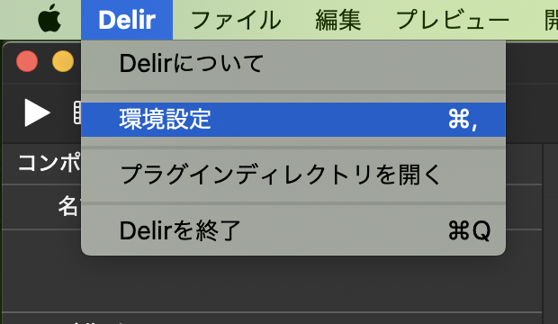
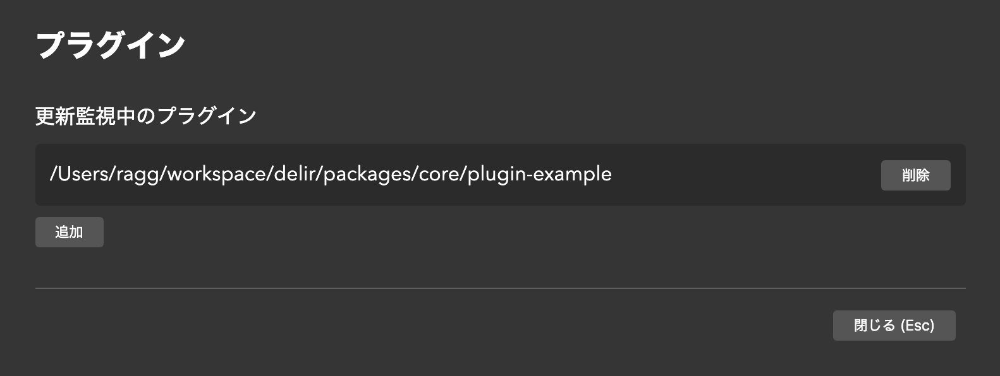

# プラグイン開発

このセクションでは、Delir のプラグイン開発について解説します。

Delir Alpha.7 では「ポストエフェクトプラグイン」のみ対応しています。
(その他のユーティリティ系プラグインは対応検討中です)

## 開発中のプラグインを読み込む

開発中のプラグインを読み込むことにより、**自動再読み込み（ホットリロード）**が出来ます。
開発中のプラグインを読み込むには、以下の手順でプラグインのディレクトリを登録してください。

1. `Delir` メニューより`環境設定`を開きます
   
2. `開発` → `プラグイン` を開きます
3. `追加` をクリックし、開発中のプラグインのフォルダを指定します。(`package.json`があるディレクトリを選択)
4. プラグインがロードされ、更新の監視が始まります。
   
