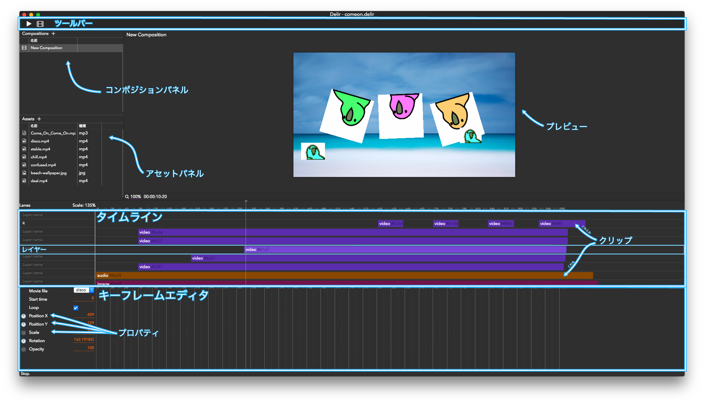
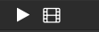
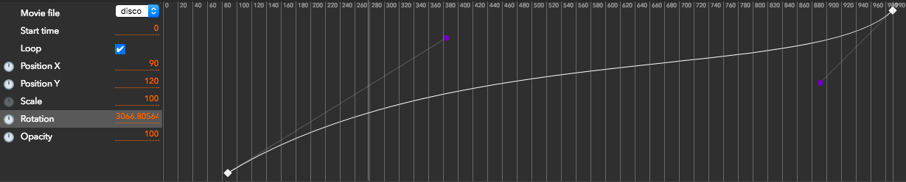
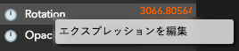
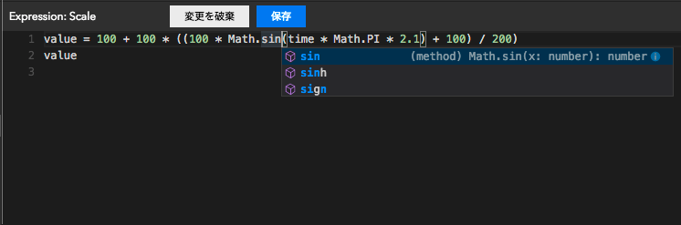

# 画面構成

#### ツールバー

左から順に
- プレビュー再生
- レンダリング

#### コンポジションパネル
プロジェクト内のコンポジションのリストです。
「Compositions **+**」の`＋`から作成することが出来ます。
（alpha.5時点で、複数のコンポジションを利用する手段はまだありません…）

#### アセットパネル
プロジェクト内で利用されているファイルの一覧です。
どんなファイルでも追加自体はできますが、対応しているレンダラ・エフェクトがなければ利用はできません。

#### プレビュー
現在のフレームのを表示しています。
タイムライン上部のフレーム番号の部分をクリックすることで、シークする事が可能です。

#### タイムライン
プロジェクトの時系列における`クリップ`の配置が表示されています。
タイムライン上で右クリックすることでクリップを作成することが出来ます。
alpha.3時点では`Video / Audio / Image / Text`の4種類のクリップを作成できます。

各クリップはドラッグアンドドロップで時間軸・レイヤーの間を移動させることが出来ます。
クリップをクリックすると、タイムラインの下にある`キーフレームエディタ`に、クリップのパラメータが表示されます。

#### キーフレームエディタ

選択されているクリップのパラメータを編集できます。
エディタ左側の`パラメータリスト`のパラメータを選択すると、エディタ右側のキーフレームエディタが表示されます。

キーフレームを置くには、キーフレームを追加したいフレームへシークした後に、パラメータ名の右側にある数値などを編集します。
（選択されたパラメータがアニメーション不可能な場合、キーフレームを追加することは出来ません。）

##### エクスプレッション

パラメータ名の上で右クリックすることで、エクスプレッションエディタを開くことが出来ます。

---

エクスプレッションエディタでは`JavaScript`によってエクスプレッションを記述できます。エディターは入力補完が有効化されており、`Ctrl+Space(mac/win問わず)`で補完候補を表示させることが出来ます。（おそらく多くのmacでは、Spotlightの補完キーと被っていると思われますが…）

