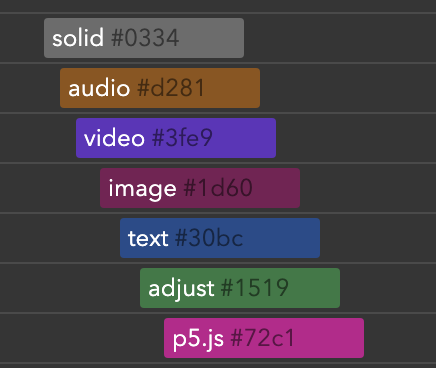

# クリップ

Delir では「クリップ」を配置していくことで動画を制作します。
Alpha.5 時点で以下の 6 種類のクリップが利用できます。

- **audio クリップ**  
  音声ファイルを扱うクリップです。  
  wav / mp3 / webm / mp4 (AAC) / ogg 形式に対応しています
- **video クリップ**  
  映像ファイルを扱うクリップです。  
  mp4 (H.264 + AAC) / webm / ogg 形式に対応しています
  （アルファチャンネル付き形式には現在対応していません）
- **image クリップ**  
  画像ファイルを扱うクリップです。  
  png / jpeg / svg / gif 形式に対応しています
  （アニメーションGIFは静止画として表示されます）
- **text クリップ**  
  テキストを表示するクリップです。
- **adjustment クリップ**  
  調整クリップです。このクリップより下に配置されたクリップ全体に対して  
  調整クリップに適用されたエフェクトを適用することができます。
- **p5.js クリップ**  
  p5.jsのプログラムコードを記述することで映像を描写するクリップです。  
